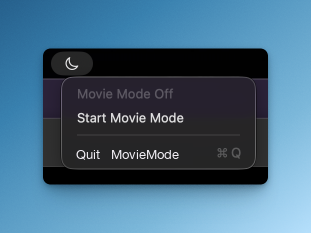

# MovieMode

<p align="center">
  
</p>

<p align="center">
  A one-click movie mode for multi-display Macs — with optional <strong>auto movie mode</strong> when you fullscreen VLC, IINA, or the browser.
</p>

<p align="center">
  <a href="https://github.com/liewcf/movie-mode">Upstream: liewcf/movie-mode</a>
</p>

<p align="center">
  
</p>

MovieMode is a small macOS menu bar app that helps you watch on one display while visually blacking out the others. Turn it on manually from the menu bar, or enable **auto movie mode** to shield extra displays when fullscreen playback starts.

> MovieMode creates black shield windows on non-main displays. It does not sleep, power off, disable, mirror, or rearrange monitors.

## What It Does

- Toggles movie mode from the macOS menu bar.
- Optionally turns on automatically when VLC, IINA, or a browser enters fullscreen.
- Keeps your chosen display(s) visible using a configurable display rule.
- Covers other active displays with borderless black shield windows.
- Restores the extra displays when movie mode ends.

## Install

### Download From Releases

For normal use, download the latest `MovieMode.app` from [GitHub Releases](https://github.com/liewcf/movie-mode/releases).

Early builds may be unsigned. If macOS blocks the app the first time you open it, right-click `MovieMode.app`, choose **Open**, then confirm that you want to open it.

### Build From Source

Requirements:

- macOS 13 or later
- Swift 5.9 or later

```sh
git clone https://github.com/liewcf/movie-mode.git
cd movie-mode
./script/build_and_run.sh
```

The script builds `dist/MovieMode.app`, installs the app icon, launches MovieMode as a menu bar accessory, and replaces any existing `MovieMode` or legacy `FocusMonitor` process.

## Use MovieMode

- Left-click the menu bar icon to turn movie mode on or off.
- Right-click the menu bar icon for status, manual toggle, **Auto Movie Mode**, **Settings**, or quit.

When movie mode is on, the menu bar icon changes and shield windows cover the displays chosen by your display rule.

### Auto Movie Mode

1. Right-click the menu bar icon and enable **Auto Movie Mode**, or open **Settings** and turn on **Enable auto movie mode**.
2. Choose a **Display rule**:
   - **Playing display** (default): the fullscreen display stays visible; others are shielded.
   - **Main display**: the macOS main display stays visible; auto runs when fullscreen is on the main display.
   - **Watch display**: a display you pick stays visible; auto runs when fullscreen is on that display.
3. **Also keep Main Display visible** (default on): keeps your main display unshielded even when video plays on another screen.
4. For YouTube and other browsers, enable **Use Accessibility for browser detection** and grant Accessibility permission to MovieMode when macOS prompts you.

Auto mode is off by default. Manual left-click still works when auto is off.

**Left-click while auto is active:** first click keeps movie mode on but switches to manual control (fullscreen exit will not auto-dismiss). Click again to turn movie mode off.

Open **Settings** from the menu bar right-click menu (not from the system Settings app). MovieMode is a menu bar accessory and uses its own settings window.

After changing the app, rebuild before launching from `dist/`:

```sh
./script/build_and_run.sh
```

## Privacy And Safety

MovieMode runs locally on your Mac. It has no accounts, no analytics, and no network service.

Version 1 only creates visual shield windows. It does not use private display APIs or change monitor power state.

## Build And Test

```sh
swift build
swift test
```

For a quick launch check:

```sh
./script/build_and_run.sh --verify
```

## FAQ

### Does MovieMode turn off my monitors?

No. MovieMode visually blacks out extra displays with black windows. Your monitors remain on.

### Which display stays visible?

By default, **Playing display** keeps the fullscreen monitor visible and shields the rest. With **Also keep Main Display visible** enabled, the macOS main display stays visible too. Change the rule in Settings.

### Does auto mode work with VLC, IINA, and YouTube?

Yes. VLC and IINA work with the built-in window detection. Browsers are more reliable when **Use Accessibility for browser detection** is enabled in Settings.

### Does MovieMode read my screen or send data anywhere?

No network usage. Optional Accessibility access is only used to detect fullscreen browser windows when you enable that setting. Window detection otherwise uses local window information from macOS.

### Why does macOS warn me when opening the app?

Early public builds may be unsigned. If you trust the build, right-click the app, choose **Open**, and confirm the prompt.

### How do I quit MovieMode?

Right-click the menu bar icon and choose **Quit MovieMode**.

## Development

MovieMode is a SwiftPM macOS app.

- Public app identity, executable target, bundle, and process name: `MovieMode`
- Internal testable core module: `FocusMonitorCore`
- Built app bundle: `dist/MovieMode.app`

## License

MovieMode is available under the MIT License. See [LICENSE](LICENSE).
